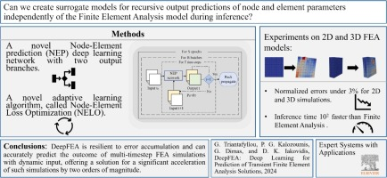

# DeepFEA



DeepFEA is a deep learning model designed to predict solutions of transient Finite Element Analysis (FEA) simulations. Built with PyTorch, it offers a data-driven alternative to traditional numerical solvers, enabling faster and more efficient simulation workflows.

## 📄 Overview

This repository accompanies the paper:

> Triantafyllou, G., Kalozoumis, P. G., Dimas, G., & Iakovidis, D. K. (2025). DeepFEA: Deep learning for prediction of transient finite element analysis solutions. *Expert Systems with Applications*, 269, 126343. https://doi.org/10.1016/j.eswa.2024.126343


DeepFEA is specifically designed to handle **multi-timestep prediction** tasks in transient Finite Element Analysis (FEA). By learning temporal dependencies in simulation data, it can:

- Accurately approximate the dynamic behavior of physical systems over time.
- Significantly reduce computational cost compared to traditional solvers.
- Maintain high fidelity across multiple future steps.

> 🧠 In this work, DeepFEA demonstrates how deep neural networks can be trained to accurately approximate the dynamic behavior of physical systems modeled via transient FEA simulations, significantly reducing computational cost while maintaining high fidelity for multi-timestep prediction.


## ⚙️ Installation

To set up the environment, use the provided conda configuration:

```bash
conda env create -f deepfea.yml
```

## 📁 Dataset

The datasets from the DeepFEA paper are available at:

- Zenodo DOI: https://doi.org/10.5281/zenodo.10870936

This dataset contains transient 2D and 3D FEA simulation data used for training and evaluation.

## 🚀 Usage

To train the model, run:

```bash
python train.py
```

## 📚 Citation

If you use DeepFEA in your research, please cite:

```bibtex
@article{Triantafyllou2025DeepFEA,
  title={DeepFEA: Deep learning for prediction of transient finite element analysis solutions},
  author={Triantafyllou, G. and Kalozoumis, P. G. and Dimas, G. and Iakovidis, D. K.},
  journal={Expert Systems with Applications},
  volume={269},
  pages={126343},
  year={2025},
  publisher={Elsevier},
  doi={10.1016/j.eswa.2024.126343}
}
```

